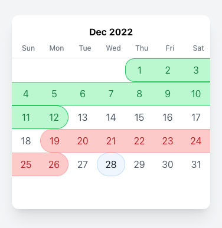

# date-range-picker

A Custom Calendar date range picker working with tailwind
Manage booked Days in the calendar and get selected date via setDateRange.
The selection will not allow to select a Date Range with Booked days inside the selection

```
import DatePicker from "./components/date-picker/date-picker";
const [dateRange, setDateRange] = useState<datePicked[] | undefined>();
const bookedDays = [
   { startDate: new Date("2022-11-7"), endDate: new Date("2022-11-12") },
   { startDate: new Date("2022-12-19"), endDate: new Date("2022-12-26") },
];
<DatePicker setDateRange={setDateRange} bookedDays={bookedDays} />
```



